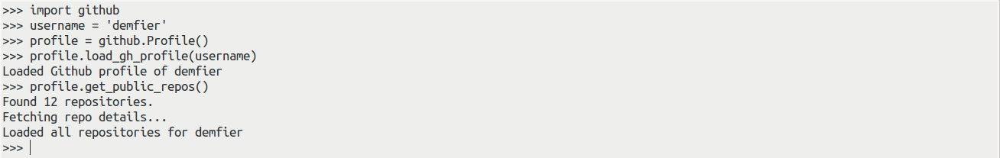
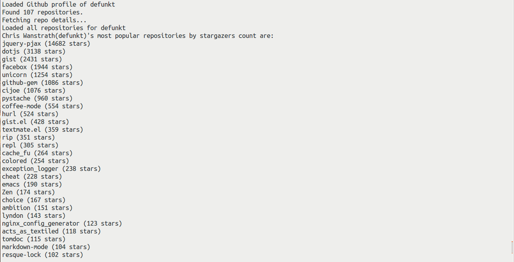

## Github library to interact with it's public API

Requirements:
<br>------------------
* [pytest](http://doc.pytest.org/en/latest/): Uses __pytest__ as the unit-testing framework. Install using <code>pip install pytest</code>.
* [requests](https://pypi.python.org/pypi/requests/2.11.1): Uses __requests__ for interacting with the various api urls.

How to use:
<br>--------------
* __Load Github Profile & Public Repo details of a user__: Loading a github profile just needs a _username_ to startwith. Here is a small demo with _username_ [__demfier__](https://github.com/Demfier).<br>

Type the following commands in python shell:

```python
import github

username = 'demfier'
profile = github.Profile()
profile.load_gh_profile(username)  # loads profile details of `username`
profile.get_public_repos()  # loads all the public repo details of `username`
```

It will look something like this:<br>

* __Run Tests__: Just run the command<code>py.test -v</code> to see the test results.


## Bonus:
The Bonus task given was to get the most popular repos of user 'defunkt' by stargazers count.<br>
Type <code>python most_popular_repo.py</code> in the terminal.<br>

Here is the output expected you are expected to see (of course assuming that there is no change in 'defunkt' stats)<br>
<br>
